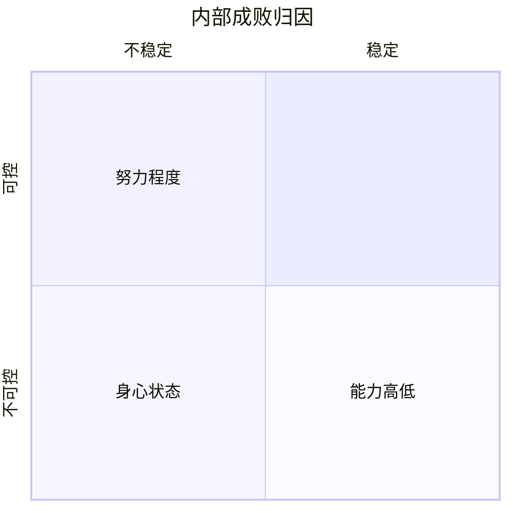
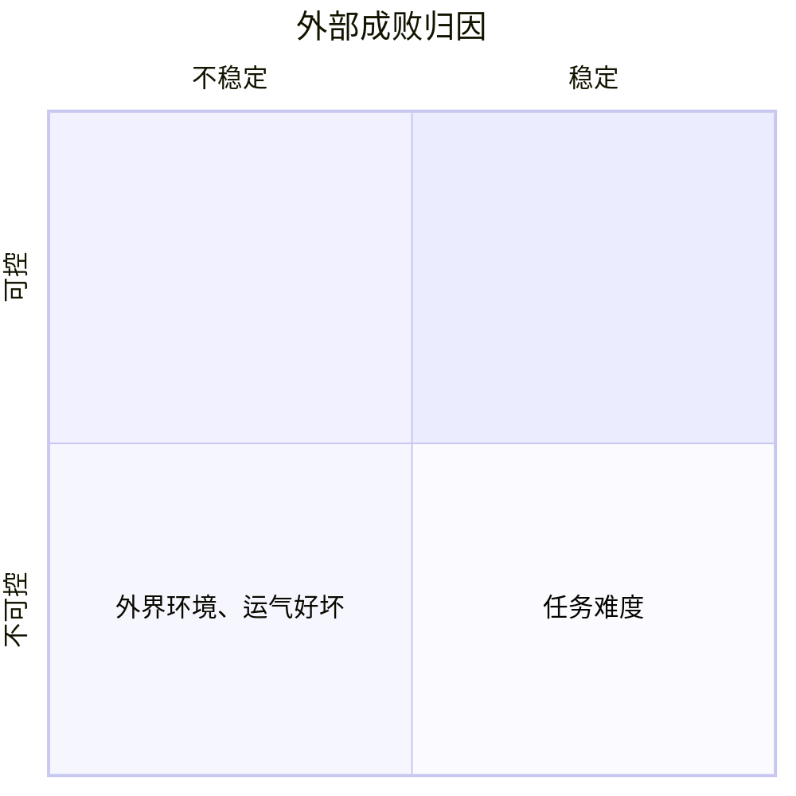

---
tags:
  - 教资/科二
---

```mermaid
quadrantChart
	title 内部成败归因
	x-axis "不稳定" --> "稳定"
	y-axis "不可控" --> "可控"
	quadrant-2 "努力程度"
	quadrant-3 "身心状态"
	quadrant-4 "能力高低"
```
 

```mermaid
quadrantChart
	title 外部成败归因
	x-axis "不稳定" --> "稳定"
	y-axis "不可控" --> "可控"
	quadrant-3 "外界环境、运气好坏"
	quadrant-4 "任务难度"
```