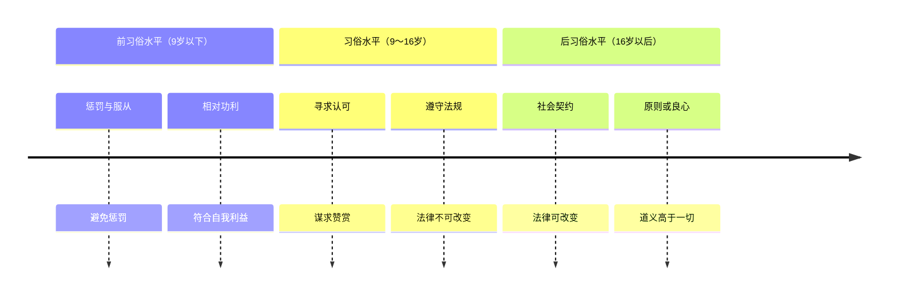

---
tags:
- 教资/科二
---

[[道德发展论]]

```mermaid
timeline
	section 前习俗水平（9岁以下）
		惩罚与服从 : 避免惩罚
		相对功利 : 符合自我利益
	section 习俗水平（9～16岁）
		寻求认可 : 谋求赞赏
		遵守法规 : 法律不可改变
	section 后习俗水平（16岁以后）
		社会契约 : 法律可改变
		原则或良心 : 道义高于一切
```