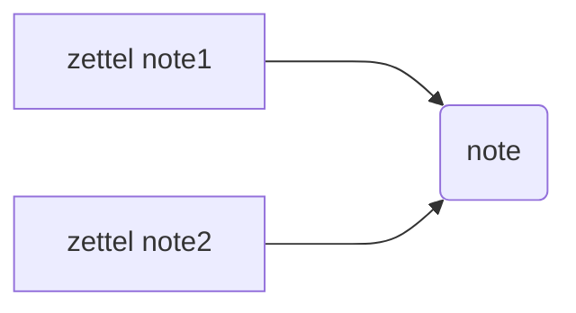
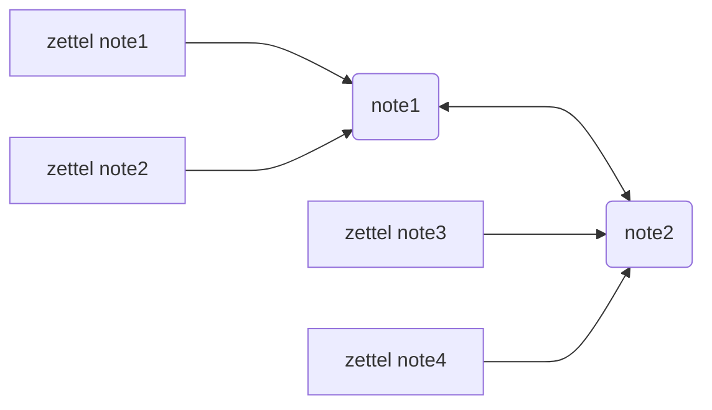

---
tags:
  - note/fleeting
---

### 笔记格式的思考
***zettel note 指向笔记汇总***

***笔记汇总之间相互连接***

***最终形成网络***

- zettel note 设置 local graph view 深度为2，就能看到关联知识
- note 设置 local graph view 深度为1，就能看到知识之间的联系

>[!hint] 如何记录考试笔记
>没有必要摘抄 CocoPolaris 的笔记。我要做的是刷*粉笔app*，然后把不熟悉的题目用名为 zettel id 的笔记记录。

### 工具需求
>[!question]
>如何自动生成zettel id？